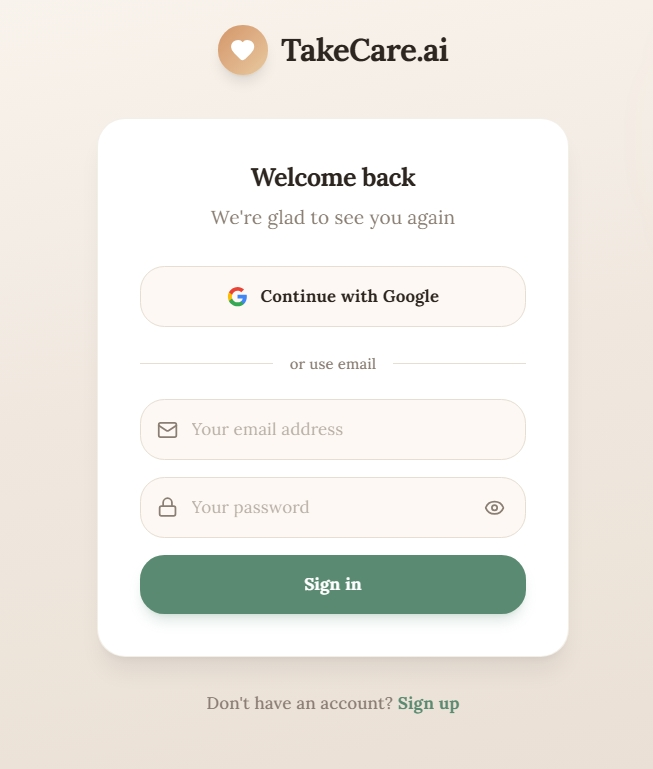
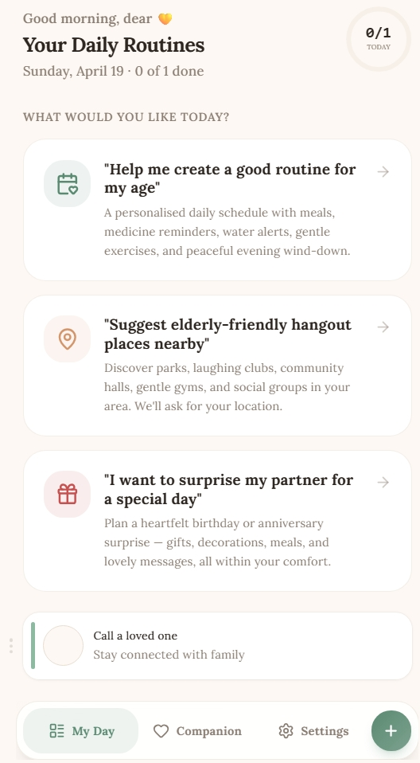

<div align="center">

# 💛 TakeCare.ai — Project Overview

### *Bringing warmth, independence, and AI-powered care to every elderly home*


</div>

---

## 💡 Inspiration

The idea for TakeCare.ai was born from a deeply personal observation — millions of elderly individuals live alone, struggle with daily routines, and often feel disconnected from the world around them. Their families worry constantly, yet can't always be present.

We asked ourselves: *what if technology could fill that gap — not with cold, robotic efficiency, but with genuine warmth and patience?*

The elderly demographic is the most underserved in consumer technology. Apps are built for speed, for the young, for the tech-savvy. We wanted to flip that entirely. TakeCare.ai was inspired by the belief that **AI should feel like a friend, not a feature** — one that remembers your name, speaks clearly, listens patiently, and is always available at 3am when you can't find your glasses.

The rise of multimodal AI — particularly Google's Gemini — made this vision finally achievable. A model that can see a photo of a cluttered room and tell you exactly where your keys are, or hold a warm conversation about your grandchildren, represents a genuine leap in what care technology can offer.

---

## 🔍 What It Does

TakeCare.ai is a **senior-first AI companion web app** that combines four core capabilities into one accessible, beautifully designed experience:

### 🤖 AI Companion Chat — Powered by Gemini 2.0 Flash
The heart of the app. Users can have natural, flowing conversations with an AI companion that:
- Greets them by their **first name** on every visit
- Responds with **real-time streaming** — text appears word by word, just like a real conversation
- **Reads every response aloud** via Web Speech API, so users never need to read if they don't want to
- Accepts **voice input** — just speak naturally, no typing required
- Produces clean, asterisk-free output specifically optimised for text-to-speech rendering

### 📷 Photo-Based Item Finder — Gemini Vision
One of the most practical features for elderly users. They frequently misplace everyday items — keys, glasses, medicine, TV remotes. With TakeCare.ai:
- The user takes or uploads a photo of any room
- **Gemini's multimodal vision** analyses the image and identifies the exact location of misplaced items
- The response is spoken aloud immediately

### 📅 Daily Habit & Routine Tracker
A gentle, structured way to maintain daily wellness:
- Add, edit, and complete daily routines with large, touch-friendly cards
- Drag-and-drop reordering
- Streak tracking with milestone celebrations
- Cloud sync via Supabase when signed in, local storage as fallback

### 🔐 Secure, Frictionless Authentication
- One-tap **Google OAuth** sign-in — no passwords to remember
- Email + password as fallback
- Full session persistence across devices



---

## 🛠️ How We Built It

### Frontend Architecture
Built on **TanStack Start** with React 19 and TypeScript — a full-stack SSR framework that gives us server-side rendering for fast initial loads and SEO, while keeping the UI fully reactive.

**Routing** is file-based via TanStack Router, with dedicated routes for the landing page, auth, companion chat, habit tracker, settings, and OAuth callback handling.

**Styling** uses Tailwind CSS v4 with a fully custom design system — warm cream and sage green tokens, a rich dark mode, and an extensive animation library built from scratch including scroll-reveal, spring-physics card pops, parallax hero, and a typewriter effect that cycles through words like *friend*, *companion*, *caregiver*.

### AI Integration — Gemini 2.0 Flash
The AI layer is the technical centrepiece of the project. We integrated **Google's Gemini 2.0 Flash** model for both text generation and vision analysis through its REST API.

Key engineering decisions:

- **Streaming responses** — we use the streaming endpoint so text renders token-by-token, creating a natural conversational feel rather than a jarring all-at-once response
- **Multimodal vision** — images are base64-encoded client-side and sent inline with the prompt, enabling real-time photo analysis without any server-side image processing pipeline
- **Request queue with exponential backoff** — a custom `gemini.ts` module manages a single in-flight request at a time, enforces a minimum 2-second gap between calls, and retries on 429/503 with exponential backoff — making the integration resilient under free-tier rate limits
- **TTS-optimised prompting** — the system prompt explicitly instructs Gemini never to use asterisks or markdown formatting, since every response is piped directly to the Web Speech API

```
System: You are a warm caring companion for elderly people.
Use simple language, be concise and kind.
IMPORTANT: Never use asterisks (*) — text is converted to speech.
```

### Backend & Data
- **Supabase** for PostgreSQL database, authentication, and file storage
- **Prisma** as the ORM for type-safe database access
- **Row Level Security** on all tables — users can only access their own data
- Photos uploaded to Supabase Storage, with public URLs passed to Gemini for vision analysis

### Deployment
- **Vercel** for production hosting with a custom SSR serverless function (`api/ssr.js`) that wraps the TanStack Start server bundle
- Static assets served from Vercel's CDN with immutable cache headers


---

## 🧱 Challenges We Ran Into

### 1. Gemini API Rate Limits on Free Tier
The free tier quota was exhausted rapidly during development. We solved this by building a proper request management layer — a queue system that serialises requests, enforces minimum gaps between calls, and implements exponential backoff retry logic. This made the app resilient without requiring paid API access during the hackathon.

### 2. SSR + OAuth Callback Complexity
TanStack Start's SSR architecture meant that the standard Supabase OAuth redirect flow needed a dedicated `/auth/callback` route to intercept the token hash from the URL, exchange it for a session, and navigate the user correctly. Getting this right across both local development and production required careful handling of the `onAuthStateChange` listener timing.

### 3. Vercel SSR Deployment
The project uses TanStack Start with a Node.js SSR server — not a static site. Vercel's default static deployment assumptions caused 404 errors. We resolved this by writing a custom `api/ssr.js` serverless function that bridges Vercel's Node.js `req/res` interface to TanStack Start's Web Fetch API `server.fetch()` handler, with proper streaming support.

### 4. Text-to-Speech + AI Output Formatting
Gemini's default responses include markdown formatting — asterisks for bold, hyphens for lists — which the Web Speech API reads literally as "asterisk asterisk word asterisk asterisk". We solved this at the prompt level by explicitly instructing the model to produce plain text only, and validated it across dozens of response types.

### 5. Google OAuth in Production
Coordinating the three-way trust between the app's production URL, Supabase's auth callback endpoint, and Google Cloud Console's authorised redirect URIs required precise configuration across all three platforms simultaneously.


---

## 🏆 Accomplishments That We're Proud Of

- **Gemini Vision working end-to-end in the browser** — a user can take a photo on their phone, and within seconds hear the AI describe exactly where their misplaced item is. That moment of genuine utility for an elderly user is something we're deeply proud of.

- **Streaming AI responses with real-time TTS** — the combination of token-by-token streaming text and simultaneous speech synthesis creates an experience that genuinely feels like talking to someone, not querying a database.

- **Zero-friction authentication** — one tap with Google, and the app knows your name, syncs your habits, and greets you personally. No passwords, no setup friction.

- **A design system built for dignity** — most apps treat accessibility as an afterthought. We built the entire visual language around elderly users first — large touch targets (48px minimum), high contrast ratios, Lora serif typography for readability, and a warm colour palette that feels welcoming rather than clinical.

- **Production deployment on Vercel with full SSR** — shipping a server-rendered React app with a custom serverless function bridge, proper OAuth flows, and CDN-cached static assets is a complete, production-grade architecture.



---

## 📚 What We Learned

**Multimodal AI is genuinely transformative for accessibility.** Gemini's ability to understand both text and images in a single API call — with no additional infrastructure — opens up use cases that simply weren't possible two years ago. The item-finder feature would have required a dedicated computer vision pipeline previously; now it's 15 lines of code.

**Streaming matters more than speed.** A 3-second response that streams feels faster and more natural than a 1-second response that appears all at once. The perception of responsiveness is as important as actual latency, especially for elderly users who may feel anxious waiting for a blank screen.

**Prompt engineering is product engineering.** The instruction to avoid asterisks, the system persona, the instruction to use the user's name — these aren't afterthoughts. They are core product decisions that live in the prompt. Getting the AI's "personality" right required as much iteration as any UI component.

**SSR adds real complexity but real value.** Server-side rendering means the landing page loads with content immediately, is indexable by search engines, and works even on slow connections. For a product targeting elderly users who may be on older devices, that matters.

**Accessibility is a design constraint, not a feature.** Building for elderly users forced us to make decisions — larger text, higher contrast, simpler navigation — that made the app better for everyone.

---

## 🚀 What's Next for TakeCare.ai

### Near-term
- **Medication reminders with photo verification** — take a photo of your pill bottle, Gemini reads the label and sets the reminder automatically
- **Family dashboard** — a separate view for family members to see their loved one's activity, streaks, and wellbeing check-ins
- **Multilingual support** — Gemini's multilingual capabilities make it straightforward to support Hindi, Tamil, Bengali, and other Indian languages natively

### Medium-term
- **Proactive check-ins** — the companion reaches out if no activity is detected by a certain time, with a gentle "Good morning, are you okay?" message
- **Memory journal** — the AI remembers key facts shared in conversation (grandchildren's names, favourite foods, health conditions) and references them naturally in future chats
- **Emergency contact integration** — one-tap alert to family members with location sharing

### Long-term
- **Voice-only mode** — a fully hands-free experience for users with limited mobility or vision impairment
- **Wearable integration** — connect with health data from smartwatches to provide context-aware wellness conversations
- **Offline AI** — explore on-device model inference for users in areas with unreliable internet connectivity

---

<div align="center">

*TakeCare.ai — because everyone deserves a companion who's always there.*

💛

</div>
