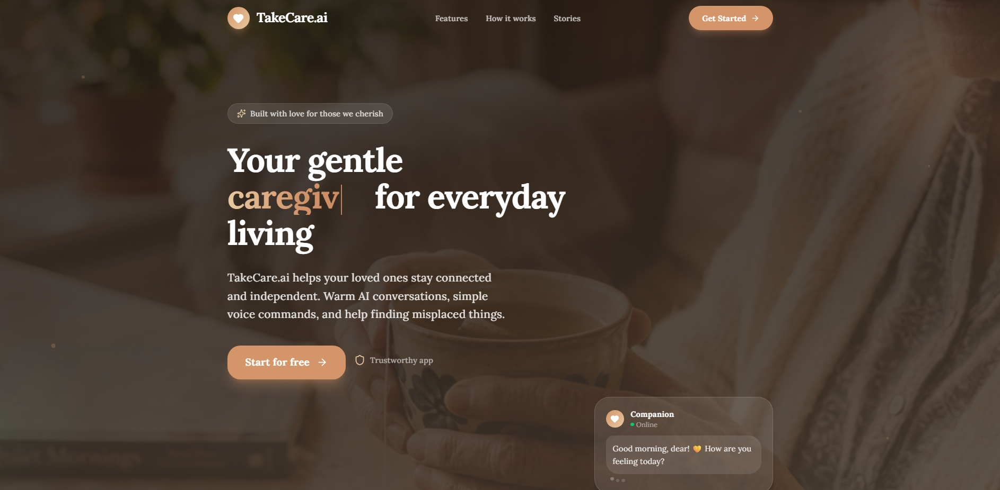
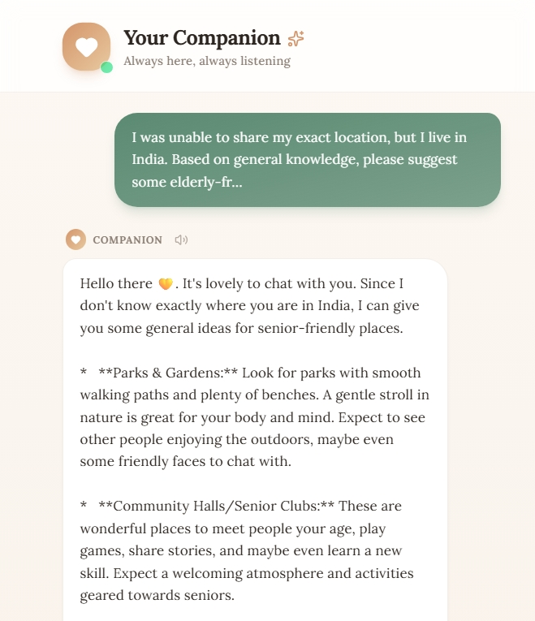
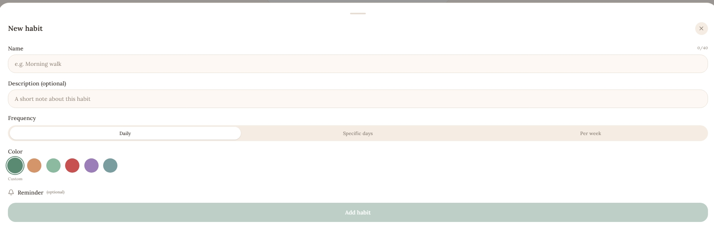

<div align="center">

# 💛 TakeCare.ai

### *Your gentle companion for everyday living*

A warm, accessible AI companion app designed for elderly users — featuring voice chat, daily habit tracking, photo-based item finding, and a caring AI that knows your name.

<br />



<br />

[](https://react.dev)
[](https://typescriptlang.org)
[](https://tailwindcss.com)
[](https://supabase.com)
[](https://vitejs.dev)

</div>

---

## 🌟 What is TakeCare.ai?

TakeCare.ai is a **senior-first AI companion app** built with empathy at its core. It helps elderly users stay connected, maintain daily routines, and get warm conversational support — all through a beautifully simple interface with large buttons, clear text, and voice interaction.

> *"I was lonely after my husband passed. TakeCare.ai gives me someone to talk to every morning."*

---

## ✨ Features

### 🤖 AI Companion Chat
- Powered by **Gemini 2.0 Flash** an reliable resource
- Real-time **streaming responses** that appear word by word
- Personalized greeting using the user's **first name**
- **Text-to-speech** reads every response aloud
- **Voice input** via Web Speech API — just speak naturally
- No asterisks in responses — clean, TTS-friendly output

### 📷 Photo-Based Item Finder
- Upload or take a photo of any room
- AI uses **Gemini Vision** to identify and locate misplaced items
- Finds keys, glasses, medicine, phone, wallet, remote — anything
- Image stored securely in **Supabase Storage**

### 📅 Daily Habit Tracker
- Add, edit, and track daily routines
- **Drag-and-drop** reordering with `@dnd-kit`
- Streak tracking with milestone celebrations 🎉
- Frequency scheduling (daily, weekly, custom days)
- Cloud sync when signed in, local storage as fallback

### 🔐 Authentication
- **Google OAuth** sign-in (one tap, no passwords)
- Email + password sign-up
- Supabase Auth with session persistence
- Secure `/auth/callback` route for OAuth redirect handling

### 🎨 Beautiful Design
- Warm cream & sage green light theme
- Rich dark mode with proper contrast
- Scroll-reveal animations with spring physics
- Typewriter hero animation cycling through: *friend, partner, companion, caregiver, guide*
- Floating particles, parallax hero, animated stat counters
- Fully responsive — mobile first

---

## 🛠️ Tech Stack

| Layer | Technology |
|---|---|
| **Framework** | [TanStack Start](https://tanstack.com/start) + React 19 |
| **Language** | TypeScript 5.8 |
| **Styling** | Tailwind CSS v4 + custom animations |
| **UI Components** | Radix UI + shadcn/ui |
| **Routing** | TanStack Router (file-based) |
| **Auth** | Supabase Auth + Google OAuth |
| **Database** | Supabase (PostgreSQL) |
| **AI** | Gemini 2.0 Flash (text + vision) |
| **Drag & Drop** | @dnd-kit |
| **Build** | Vite 7 |
| **Deploy** | Cloudflare Workers |

---

## 🚀 Getting Started

### Prerequisites

- Node.js 18+
- A [Supabase](https://supabase.com) project
- Google OAuth credentials (for Google sign-in)

### 1. Clone the repository

```bash
git clone https://github.com/yourusername/takecare-ai.git
cd takecare-ai
```

### 2. Install dependencies

```bash
npm install
```

### 3. Set up environment variables

Create a `.env.local` file in the root:

```env
VITE_SUPABASE_URL=https://your-project.supabase.co
VITE_SUPABASE_PUBLISHABLE_KEY=your_supabase_anon_key

# Database (for Prisma)
DATABASE_URL=postgresql://...
DIRECT_URL=postgresql://...
```

### 4. Configure Supabase

In your Supabase dashboard:

1. Go to **Authentication → Providers** and enable **Google**
2. Add your Google OAuth Client ID and Secret
3. Go to **Authentication → URL Configuration** and add:
   - `http://localhost:8080/auth/callback`
   - `https://yourdomain.com/auth/callback`

### 5. Run the development server

```bash
npm run dev
```

Open [http://localhost:8080](http://localhost:8080) 🎉

---

## 📁 Project Structure

```
takecare-ai/
├── src/
│   ├── routes/
│   │   ├── __root.tsx          # Root layout, loads puter.js
│   │   ├── index.tsx           # Landing page
│   │   ├── login.tsx           # Auth page (Google + email)
│   │   ├── app.tsx             # Daily habits dashboard
│   │   ├── insights.tsx        # AI companion chat
│   │   ├── settings.tsx        # User settings
│   │   └── auth/
│   │       └── callback.tsx    # OAuth redirect handler
│   ├── components/
│   │   ├── HabitCard.tsx       # Draggable habit card
│   │   ├── AddHabitSheet.tsx   # Add habit bottom sheet
│   │   ├── BottomNav.tsx       # Mobile navigation
│   │   ├── ProgressRing.tsx    # Circular progress indicator
│   │   └── ui/                 # shadcn/ui components
│   ├── lib/
│   │   ├── gemini.ts           # Puter.js AI client (streaming + vision)
│   │   ├── habits.ts           # Habit logic (local)
│   │   ├── habits-cloud.ts     # Habit sync (Supabase)
│   │   └── notifications.ts    # Reminder scheduling
│   ├── hooks/
│   │   ├── use-auth.ts         # Auth state hook
│   │   └── use-theme.ts        # Dark/light mode
│   ├── integrations/
│   │   ├── supabase/           # Supabase client + types
│   │   └── lovable/            # Lovable OAuth wrapper
│   └── styles.css              # Global styles + animations
├── prisma/
│   └── schema.prisma
├── public/
└── package.json
```

---


## 🎨 Design System

### Color Palette

| Token | Light | Dark |
|---|---|---|
| Background | `#FDF8F3` | `#1C1816` |
| Card | `#FFFFFF` | `#2A2421` |
| Primary (Sage) | `#5B8A72` | `#8BBAA1` |
| Warm (Terracotta) | `#D4956A` | `#D4956A` |
| Foreground | `#2D2520` | `#F5EDE4` |

### Animations
- `animate-fade-up-blur` — page entry
- `animate-gentle-breathe` — logo pulse
- `card-pop-on-scroll` — spring bounce on scroll reveal
- `flash-border` — golden glow flash on card entry
- Typewriter effect — letter-by-letter typing + backspace

---

## 📱 Screenshots

| Landing Page | AI Companion | Habit Tracker |
|---|---|---|
|  |  |  |

---

## 🔒 Privacy & Security

- 🔐 All auth handled by Supabase — no passwords stored in app
- 🗄️ User data isolated by Row Level Security (RLS)
- 📷 Photos uploaded to private Supabase Storage bucket
- 🤖 AI conversations processed by Puter.js — no data retained
- 🚫 No tracking, no ads, no data sharing

---

## 🤝 Contributing

Contributions are welcome! Please open an issue first to discuss what you'd like to change.

```bash
# Fork the repo, then:
git checkout -b feature/your-feature
git commit -m "Add your feature"
git push origin feature/your-feature
# Open a Pull Request
```

---

## 📄 License

MIT © 2025 TakeCare.ai

---

<div align="center">

Made with 💛 for the people we cherish most

*Simple. Warm. Always there.*

</div>
